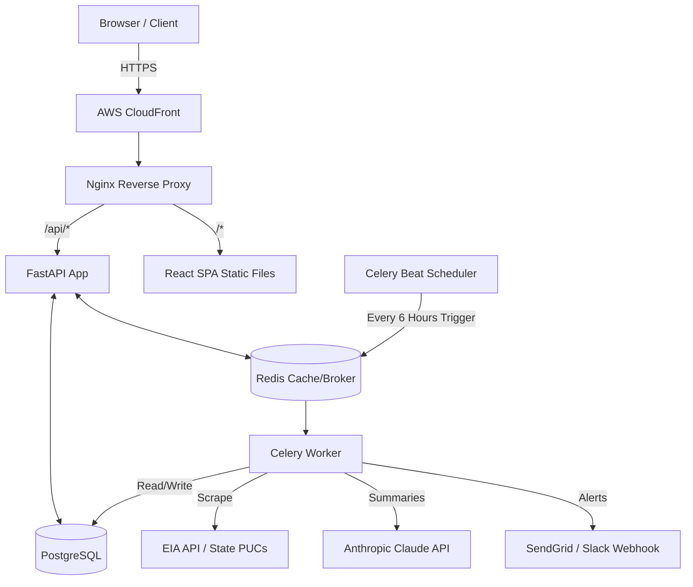

# EnergyPulse


**Live Demo:** [https://dvzc65cpn8cgf.cloudfront.net](https://dvzc65cpn8cgf.cloudfront.net)

## Overview

EnergyPulse is a live energy market intelligence dashboard designed to ingest, analyze, and visualize electricity and natural gas prices across key U.S. markets (IL, TX, OH, CA, NY). It leverages statistical analysis to detect pricing anomalies, generates AI-powered market summaries via the Anthropic Claude API, and alerts stakeholders in real-time.

The system is fully containerized, utilizing scheduled, asynchronous microservices for robust data collection and processing.

## Architecture



## Tech Stack

**Backend**
*   **Python 3.10 & FastAPI:** Asynchronous REST API serving high-throughput data requests.
*   **SQLAlchemy 2.0 & Alembic:** Database ORM utilizing async sessions (`AsyncSession` + `run_sync` pattern) and structured schema migrations.
*   **Celery & Redis:** Background task queue and scheduler (`celery beat`) for automated ingestion (every 6 hours) and alert jobs.
*   **PostgreSQL:** Persistent relational data store.
*   **BeautifulSoup 4 & Playwright:** Automated web scraping for dynamic state Public Utility Commission (PUC) sites and EIA Open Data API integration.
*   **Anthropic Claude API:** Generates contextual AI market summaries based on price fluctuations.
*   **Gunicorn:** Production WSGI server running 4 Uvicorn worker processes.

**Frontend**
*   **React + TypeScript + Vite:** Fast, strictly-typed single-page application.
*   **Recharts:** Interactive, responsive charting for historical price trends.
*   **Tailwind CSS:** Utility-first styling with a responsive dark theme.

**Infrastructure & Deployment**
*   **Docker & Docker Compose:** Multi-container orchestration (6 containers: app, worker, beat, postgres, redis, frontend) using multi-stage builds (`linux/amd64`).
*   **AWS EC2 & ECR:** Hosted on Ubuntu 24.04 (t3.micro) with container images managed via Elastic Container Registry.
*   **AWS CloudFront:** Global Content Delivery Network (CDN) with HTTPS termination.
*   **Nginx:** Reverse proxy routing `/api/*` to the FastAPI backend and serving the React SPA for all other routes.

## Features

*   **Real-time Data Ingestion:** Scrapes electricity and natural gas prices via APIs and headless browsers, tracking 135+ price snapshots.
*   **Extensive Historical Data:** Visualizes up to 12 months of electricity and natural gas price trends.
*   **Anomaly Detection:** Statistical models evaluate price movements to flag abnormal market behaviors automatically.
*   **AI-Generated Market Summaries:** Summarizes complex pricing trends into human-readable insights using LLMs.
*   **Automated Alerting:** Dispatches real-time notifications via email (SendGrid) and Slack when anomalies are detected.
*   **Resilient Data Pipeline & Monitoring:** Uses scheduled background workers and `ON CONFLICT DO NOTHING` patterns to ensure idempotent insert behavior and deduplication, monitored via a user-friendly Data Pipeline Activity dashboard table.

## Local Development

The project is fully containerized for a smooth local development experience.

1. **Clone the repository:**
   ```bash
   git clone <repository-url>
   cd energy-pulse
   ```

2. **Set up environment variables:**
   Create a `.env` file in the project root with the required keys (e.g., `POSTGRES_PASSWORD`, `EIA_API_KEY`, `ANTHROPIC_API_KEY`, `SENDGRID_API_KEY`).

3. **Start the stack using Docker Compose:**
   ```bash
   docker compose up --build -d
   ```
   *Note: for the production compose file, use `docker compose -f docker-compose.prod.yml up --build -d`*

4. **Access the application:**
   * Frontend: `http://localhost:5173` (or port mapped to the frontend container)
   * API Documentation (Swagger UI): `http://localhost:8000/docs`

## API Endpoints

The FastAPI backend provides several key routes for data retrieval:

*   `GET /api/data/pipeline-stats`: Retrieves ingestion statistics over the last 7 days (records inserted, rejected, duplicates skipped, and top rejection reasons).
*   `GET /api/data/prices`: Fetches historical price data (filtered by region, fuel type, and time window).
*   `GET /api/data/prices/latest`: Returns the most recently fetched price snapshots for a specified region.
*   `GET /api/data/regions`: Lists all distinct tracked regions.

## Deployment

The production deployment runs on an AWS EC2 `t3.micro` instance using Ubuntu 24.04.
Container images are built locally via multi-stage Dockerfiles (`linux/amd64` architecture) and pushed to AWS ECR. 
The live environment pulls the latest images and runs them using `docker-compose.prod.yml`, ensuring identical behavior between local and production environments, with Nginx proxying requests from AWS CloudFront.